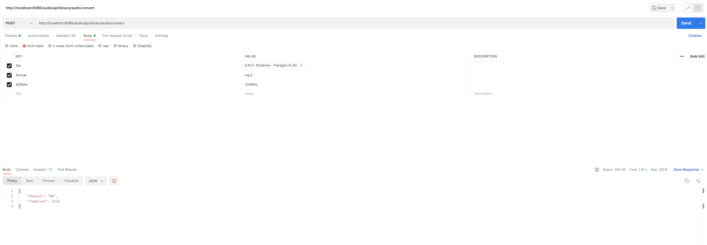

# audio
基于FFmpeg的音频格式转换工具

# 技术栈
- ffmpeg
- javacv
- springboot

# 启动命令
> application.properties需放在配置文件目录下

`java -jar -Xbootclasspath/a:配置文件目录路径 {audio.jar所在目录路径}/audio.jar`

以windows为例：

`java -jar -Xbootclasspath/a:D:\document\audio\config D:\document\audio\audio.jar`

# 使用
使用API调试软件调用系统接口（以postman为例）

# TODO
- 下载/批量打包下载（done）
- 多文件上传，每个文件单独设置格式
- 用户区分
- 网页播放器
- 定时清理audio.home（done）

